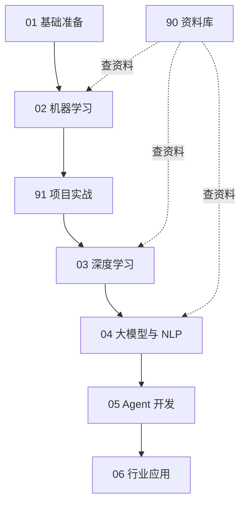

# 学习总路线

## 分阶段目标

| 阶段 | 目标 | 不要做什么 |
|---|---|---|
| 基础准备 | 会 Python、基础数学、pandas | 不要先啃深度学习 |
| 机器学习 | 会监督学习、无监督学习、评估调参 | 不要同时开很多英文课 |
| 项目实战 | 做 3 个端到端项目 | 不要只看教程不动手 |
| 深度学习 | 会 PyTorch 和神经网络主干 | 不要跳过线性模型 |
| 大模型与 NLP | 理解 Transformer、LLM、RAG | 不要先追框架 |
| Agent 开发 | 会工具调用、工作流、记忆、RAG Agent | 不要把 Agent 当聊天壳 |
| 行业应用 | 能把 Agent 用在投流等业务 | 不要脱离业务指标 |

