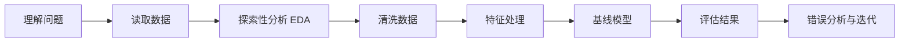

# 数据挖掘项目中文入门

对应本地源文件：

- [[../源文件/GitHub原文/team-learning-data-mining/readme|Datawhale 数据挖掘总仓库]]
- [[../源文件/GitHub原文/team-learning-data-mining/HandsOnDataAnalysis/readme|动手学数据分析]]
- [[../源文件/GitHub原文/team-learning-data-mining/SecondHandCarPriceForecast/readme|二手车价格预测项目]]
- [[../源文件/GitHub原文/team-learning-data-mining/HeartbeatClassification/readme|心跳信号分类项目]]
- [[../源文件/GitHub原文/team-learning-data-mining/RentForecast/readme|房租预测项目]]

> [!abstract]
> 这页只解决一件事：你第一次做数据挖掘项目时，到底该按什么顺序做、先写什么代码、去哪里找本地实战材料。

## 一、概要：数据挖掘项目到底在做什么

数据挖掘项目，不是“先找最强模型”，而是把原始数据一步步变成一个可解释、可评估、可提交的结果。

最小流程只有 8 步：



你可以把它理解成三段：

| 阶段 | 你在干什么 | 最终产物 |
|---|---|---|
| 数据理解 | 看懂任务、字段、标签、评分方式 | 一页问题定义 + 字段说明 |
| 建模准备 | 清洗、特征处理、切分训练集 | 可训练的数据表 |
| 模型迭代 | 训练基线、看指标、做错误分析 | 一个可复现 baseline |

## 二、先做哪类项目

第一次实战，优先做这三类：

| 项目 | 类型 | 难度 | 你会学到什么 |
|---|---|---:|---|
| [[../../91-项目实战/01-房价预测/房价预测项目说明|房价预测]] | 回归 | 低 | 缺失值、数值特征、回归指标 |
| [[../../91-项目实战/02-Titanic生存预测/Titanic生存预测项目说明|Titanic 生存预测]] | 二分类 | 低 | 类别编码、分类指标、基线模型 |
| [[../源文件/GitHub原文/team-learning-data-mining/SecondHandCarPriceForecast/readme|二手车价格预测]] | 回归竞赛 | 中 | EDA、特征工程、交叉验证 |

不要把第一个项目选成：

- 推荐系统；
- 多模态；
- 强依赖深度学习的比赛；
- 需要复杂部署的数据平台项目。

## 三、一个完整项目最少要交什么

别把项目做成“跑过一遍 notebook 就算完成”。最少要有下面这些交付物：

1. 问题定义：预测什么，标签是什么。
2. 数据说明：每列大概是什么。
3. EDA 结果：分布、缺失值、异常值、类别统计。
4. 清洗与特征处理：你改了什么，为什么。
5. 基线模型：至少一个模型和一组指标。
6. 错误分析：哪里错得多，为什么。
7. 下一步计划：你接下来优先改什么。

## 四、标准项目目录模板

第一次项目，目录不要复杂，够用就行：

```text
my-first-project/
├── data/
├── notebooks/
├── outputs/
├── train.py
├── eda.py
└── README.md
```

如果你在 Obsidian 里记录，也可以这样对应：

1. 项目说明笔记
2. 数据探索笔记
3. 基线结果笔记
4. 错误分析笔记

## 五、先写什么代码：最小 EDA 模板

第一段代码，不是训练模型，而是把数据看明白。

```python
import pandas as pd

df = pd.read_csv("train.csv")

print("shape:", df.shape)
print(df.head())
print(df.info())
print(df.describe())
print("\n缺失值统计:")
print(df.isna().sum().sort_values(ascending=False).head(20))
print("\n重复行数量:", df.duplicated().sum())
```

你至少要回答下面几个问题：

- 一共有多少行、多少列？
- 标签列是哪一列？
- 哪些是数值列，哪些是类别列？
- 哪几列缺失最多？
- 有无明显异常值或重复值？

## 六、回归项目最小 baseline 代码

适合房价预测、二手车价格预测、房租预测这类任务。

```python
import pandas as pd
from sklearn.model_selection import train_test_split
from sklearn.linear_model import Ridge
from sklearn.metrics import mean_absolute_error, mean_squared_error

df = pd.read_csv("train.csv")

target = "price"
X = df.drop(columns=[target])
y = df[target]

num_cols = X.select_dtypes(include="number").columns
cat_cols = X.select_dtypes(exclude="number").columns

X[num_cols] = X[num_cols].fillna(X[num_cols].median())
X[cat_cols] = X[cat_cols].fillna("未知")
X = pd.get_dummies(X, columns=cat_cols, dummy_na=False)

X_train, X_valid, y_train, y_valid = train_test_split(
    X, y, test_size=0.2, random_state=42
)

model = Ridge()
model.fit(X_train, y_train)
pred = model.predict(X_valid)

mae = mean_absolute_error(y_valid, pred)
rmse = mean_squared_error(y_valid, pred) ** 0.5

print("MAE:", mae)
print("RMSE:", rmse)
```

这段代码已经够你完成第一个回归 baseline。

先别急着上 LightGBM、XGBoost。先把下面几件事做对：

1. 标签列别选错；
2. 缺失值先处理；
3. 类别特征先编码；
4. 指标先跑通。

## 七、分类项目最小 baseline 代码

适合 Titanic、生还预测、心跳信号分类这类任务。

```python
import pandas as pd
from sklearn.model_selection import train_test_split
from sklearn.linear_model import LogisticRegression
from sklearn.metrics import accuracy_score, f1_score, classification_report

df = pd.read_csv("train.csv")

target = "label"
X = df.drop(columns=[target])
y = df[target]

num_cols = X.select_dtypes(include="number").columns
cat_cols = X.select_dtypes(exclude="number").columns

X[num_cols] = X[num_cols].fillna(X[num_cols].median())
X[cat_cols] = X[cat_cols].fillna("未知")
X = pd.get_dummies(X, columns=cat_cols, dummy_na=False)

X_train, X_valid, y_train, y_valid = train_test_split(
    X, y, test_size=0.2, random_state=42, stratify=y
)

model = LogisticRegression(max_iter=1000)
model.fit(X_train, y_train)
pred = model.predict(X_valid)

print("Accuracy:", accuracy_score(y_valid, pred))
print("F1:", f1_score(y_valid, pred, average="macro"))
print(classification_report(y_valid, pred))
```

第一次分类项目，够用了。

## 八、特征工程最小动作

新手最容易把“特征工程”想得太玄。第一阶段只做这几件事：

| 动作 | 例子 |
|---|---|
| 缺失值填充 | 数值列用中位数，类别列用 `"未知"` |
| 类别编码 | `pd.get_dummies()` |
| 时间拆分 | 从日期里提取年、月、日 |
| 简单组合特征 | 单价、年龄段、总人数 |
| 异常值过滤 | 去掉明显错误记录 |

一个简单例子：

```python
df["house_age"] = 2026 - df["build_year"]
df["price_per_area"] = df["price"] / (df["area"] + 1e-6)
```

先做能解释清楚的特征，不要第一轮就堆几十个花哨组合。

## 九、错误分析怎么写

错误分析不是一句“效果一般”。至少要回答这 4 个问题：

1. 哪些样本预测错得最多？
2. 错误集中在哪一类样本？
3. 是数据质量问题，还是模型表达能力不够？
4. 下一轮最值得改的是特征、样本还是模型？

回归项目可以这样看：

```python
result = X_valid.copy()
result["y_true"] = y_valid.values
result["y_pred"] = pred
result["abs_error"] = (result["y_true"] - result["y_pred"]).abs()

print(result.sort_values("abs_error", ascending=False).head(20))
```

分类项目可以这样看错分样本：

```python
result = X_valid.copy()
result["y_true"] = y_valid.values
result["y_pred"] = pred

wrong = result[result["y_true"] != result["y_pred"]]
print(wrong.head(20))
```

## 十、实践路径：本地材料怎么用

这部分直接对照你已经下载到本地的 Datawhale 源文件。

### 1. 先热身：动手学数据分析

适合完全新手先熟悉流程。

- [[../源文件/GitHub原文/team-learning-data-mining/HandsOnDataAnalysis/readme|课程说明]]

你要重点学的是：

1. 数据加载和观察；
2. 数据清洗；
3. 数据重构；
4. 数据可视化；
5. 基础建模和评估。

### 2. 回归项目：二手车价格预测

这是最适合进入“竞赛型表格项目”的本地材料之一。

- [[../源文件/GitHub原文/team-learning-data-mining/SecondHandCarPriceForecast/readme|项目总说明]]
- [[../源文件/GitHub原文/team-learning-data-mining/SecondHandCarPriceForecast/Task1 赛题理解|Task1 赛题理解]]
- [[../源文件/GitHub原文/team-learning-data-mining/SecondHandCarPriceForecast/Task2 数据分析|Task2 数据分析]]
- [[../源文件/GitHub原文/team-learning-data-mining/SecondHandCarPriceForecast/Task3 特征工程|Task3 特征工程]]
- [[../源文件/GitHub原文/team-learning-data-mining/SecondHandCarPriceForecast/Task4 建模调参 .md|Task4 建模调参]]
- [[../源文件/GitHub原文/team-learning-data-mining/SecondHandCarPriceForecast/Baseline|Baseline 代码]]
- [[../源文件/GitHub原文/team-learning-data-mining/SecondHandCarPriceForecast/data/数据说明.txt|数据说明]]

你不需要一次全学完。顺序就按：

1. `Task1` 看题目和标签；
2. `Task2` 学 EDA；
3. `Baseline` 跑通一版；
4. `Task3` 再学特征工程；
5. 最后才看 `Task4`。

### 3. 分类项目：心跳信号分类

适合做分类项目练手，也能接触更真实的信号数据。

- [[../源文件/GitHub原文/team-learning-data-mining/HeartbeatClassification/readme|项目总说明]]
- [[../源文件/GitHub原文/team-learning-data-mining/HeartbeatClassification/Task1 赛题理解|Task1 赛题理解]]
- [[../源文件/GitHub原文/team-learning-data-mining/HeartbeatClassification/Task2 数据分析|Task2 数据分析]]
- [[../源文件/GitHub原文/team-learning-data-mining/HeartbeatClassification/Task3 特征工程|Task3 特征工程]]
- [[../源文件/GitHub原文/team-learning-data-mining/HeartbeatClassification/Task4 模型调参|Task4 模型调参]]
- [[../源文件/GitHub原文/team-learning-data-mining/HeartbeatClassification/baseline|Baseline 说明]]
- [[../源文件/GitHub原文/team-learning-data-mining/HeartbeatClassification/baseline.ipynb|Baseline Notebook]]

这个项目的重点不是医学知识，而是：

- 如何处理分类标签；
- 如何看类别不平衡；
- 如何做分类评估；
- 如何从 baseline 迭代。

### 4. 进一阶：房租预测

如果你已经能做普通表格回归，可以继续看：

- [[../源文件/GitHub原文/team-learning-data-mining/RentForecast/readme|房租预测总说明]]
- [[../源文件/GitHub原文/team-learning-data-mining/RentForecast/Task1 赛题分析.ipynb|Task1 赛题分析]]
- [[../源文件/GitHub原文/team-learning-data-mining/RentForecast/Task2 数据清洗.ipynb|Task2 数据清洗]]
- [[../源文件/GitHub原文/team-learning-data-mining/RentForecast/Task3 特征工程.ipynb|Task3 特征工程]]
- [[../源文件/GitHub原文/team-learning-data-mining/RentForecast/Task4 模型选择.ipynb|Task4 模型选择]]

## 十一、建议学习顺序

别同时开很多项目。按这条线走最省力：

1. [[Python与数据处理零基础中文课]]
2. [[Pandas中文学习课]]
3. [[../../91-项目实战/01-房价预测/房价预测项目说明]]
4. [[../../91-项目实战/02-Titanic生存预测/Titanic生存预测项目说明]]
5. [[../源文件/GitHub原文/team-learning-data-mining/SecondHandCarPriceForecast/readme|二手车价格预测]]
6. [[../源文件/GitHub原文/team-learning-data-mining/HeartbeatClassification/readme|心跳信号分类]]

## 十二、一个 7 天入门实践计划

### 第 1 天

- 看项目任务和标签定义
- 打开训练数据
- 跑 EDA 模板

### 第 2 天

- 统计缺失值、重复值、类别分布
- 写 5 条数据观察

### 第 3 天

- 做最小清洗
- 生成第一版训练特征

### 第 4 天

- 跑一个 baseline
- 记录第一组指标

### 第 5 天

- 看错误最大的样本
- 写错误分析

### 第 6 天

- 加 2 到 3 个简单特征
- 再跑一次模型

### 第 7 天

- 对比前后指标
- 写项目总结

## 十三、项目最小检查表

- [ ] 我能说清问题是什么。
- [ ] 我知道标签列是哪一列。
- [ ] 我知道评价指标是什么。
- [ ] 我做了 EDA。
- [ ] 我处理了缺失值和重复值。
- [ ] 我训练了至少一个 baseline。
- [ ] 我做了错误分析。
- [ ] 我知道下一步优先改什么。

## 学完去哪里

1. [[../../91-项目实战/01-房价预测/房价预测项目说明]]
2. [[../../91-项目实战/02-Titanic生存预测/Titanic生存预测项目说明]]
3. [[../../91-项目实战/03-鸢尾花分类/鸢尾花分类项目说明]]
4. [[../../02-机器学习/机器学习核心知识中文教程]]
