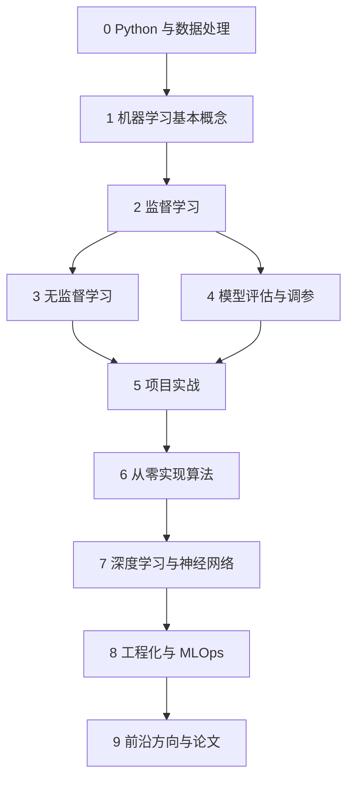

# 机器学习从零到高手学习路径

这是一条中文学习路径：先会用，再懂原理，再能做项目，最后能读论文、做工程、解决真实问题。

> [!tip]
> 主线只保留一条：**Python 数据处理 → 经典机器学习 → 项目实战 → 算法原理 → 深度学习 → 工程化与前沿**。资源很多，但学习时不要同时开很多课。

## 0. 总路线图

## 1. 阶段 0：Python 与数据处理

目标：能打开数据、清洗数据、看懂表格和图。

### 要学什么

| 知识 | 学到什么程度 |
|---|---|
| Python 基础 | 会变量、函数、循环、条件、列表、字典、文件读写 |
| NumPy | 会数组、切片、广播、矩阵乘法 |
| pandas | 会读 CSV、筛选列、处理缺失值、分组统计 |
| 可视化 | 会画直方图、散点图、折线图、箱线图 |
| Jupyter | 会运行 Notebook、记录实验过程 |

### 推荐资源

- [[90-资料库/01-GitHub原文/机器学习/zero-to-mastery-ml/README|mrdbourke/zero-to-mastery-ml]]：跟 Notebook 练 Python、pandas、sklearn。
- [[90-资料库/01-GitHub原文/机器学习/data-science-roadmap/README|Moataz-Elmesmary/Data-Science-Roadmap]]：查数据科学基础路线。
- [Kaggle Learn: Python](https://www.kaggle.com/learn/python)：短练习，适合快速上手。
- [Kaggle Learn: Pandas](https://www.kaggle.com/learn/pandas)：表格数据处理练习。

### 练习

拿一个 CSV 数据集，完成：

1. 读入数据；
2. 输出行数、列数、字段类型；
3. 统计缺失值；
4. 画 3 张图；
5. 写 5 句你从图里看到的结论。

### 过关标准

- [ ] 能用 `pandas.read_csv()` 读数据；
- [ ] 能解释 `DataFrame.shape`、`head()`、`describe()`；
- [ ] 能处理缺失值；
- [ ] 能画出特征和标签之间的关系图。

## 2. 阶段 1：机器学习基本概念

目标：知道机器学习到底在训练什么。

### 要学什么

| 概念 | 中文解释 |
|---|---|
| 样本 | 一条数据 |
| 特征 | 模型的输入变量 |
| 标签 | 模型要预测的答案 |
| 模型 | 从输入到输出的函数 |
| 损失函数 | 衡量模型错得有多离谱 |
| 优化算法 | 调整参数，让损失变小 |
| 训练集 | 用来训练模型的数据 |
| 验证集 | 用来调模型的数据 |
| 测试集 | 最后评估泛化能力的数据 |

### 推荐资源

- [[机器学习零基础入门]]
- [[90-资料库/01-GitHub原文/机器学习/ML-For-Beginners/README|microsoft/ML-For-Beginners]]：适合建立机器学习全局地图。
- [Kaggle Learn: Intro to Machine Learning](https://www.kaggle.com/learn/intro-to-machine-learning)：适合快速跑通第一个模型。
- [DeepLearning.AI Machine Learning Specialization](https://www.deeplearning.ai/courses/machine-learning-specialization/)：想系统补理论时使用。

### 练习

用一句话回答：

- 什么是监督学习？
- 回归和分类有什么区别？
- 为什么不能只看训练集准确率？
- 过拟合是什么？

### 过关标准

- [ ] 能说清监督学习、无监督学习、强化学习的区别；
- [ ] 能区分回归、二分类、多分类；
- [ ] 知道训练集、验证集、测试集分别做什么；
- [ ] 能跑通一个 sklearn 决策树模型。

## 3. 阶段 2：监督学习

目标：掌握最常用的预测模型。

### 学习顺序

| 顺序 | 模型 | 重点 |
|---:|---|---|
| 1 | 线性回归 | 连续值预测、MSE、特征标准化 |
| 2 | Logistic 回归 | 二分类、sigmoid、概率输出 |
| 3 | Softmax 回归 | 多分类、交叉熵 |
| 4 | KNN | 距离、邻居、标准化影响 |
| 5 | 决策树 | 信息增益、基尼系数、可解释性 |
| 6 | 随机森林 | 集成学习、降方差 |
| 7 | 梯度提升树 | boosting、强表格数据基线 |
| 8 | SVM | 间隔、核函数，知道思想即可 |
| 9 | 朴素贝叶斯 | 文本分类、条件独立假设 |

### 推荐资源

- [[90-资料库/01-GitHub原文/机器学习/ML-For-Beginners/README|microsoft/ML-For-Beginners]]
- [[90-资料库/01-GitHub原文/机器学习/handson-ml3/README|ageron/handson-ml3]]
- [[90-资料库/01-GitHub原文/机器学习/tutorials-scikit-learn/README|glouppe/tutorials-scikit-learn]]
- [[90-资料库/01-GitHub原文/机器学习/Machine-Learning-with-Python/README|tirthajyoti/Machine-Learning-with-Python]]
- 本项目：[[03-深度学习/01-神经网络与深度学习/chap2机器学习概述/机器学习概述-上|机器学习概述-上]]、[[03-深度学习/01-神经网络与深度学习/chap3线性模型/线性模型-上|线性模型-上]]

### 练习项目

| 项目 | 模型建议 | 指标 |
|---|---|---|
| 房价预测 | 线性回归、随机森林、梯度提升树 | MAE、RMSE |
| Titanic 生存预测 | Logistic 回归、随机森林 | accuracy、F1 |
| 垃圾邮件分类 | 朴素贝叶斯、Logistic 回归 | precision、recall、F1 |
| 客户流失预测 | Logistic 回归、随机森林、XGBoost | recall、AUC |

### 过关标准

- [ ] 能训练至少 3 种监督学习模型；
- [ ] 能解释每个模型适合什么数据；
- [ ] 能用交叉验证比较模型；
- [ ] 能写出一份简单错误分析。

## 4. 阶段 3：模型评估与调参

目标：知道模型到底好不好，而不是只看一个分数。

### 要学什么

| 主题 | 重点 |
|---|---|
| 数据切分 | 训练集、验证集、测试集 |
| 交叉验证 | 更稳定地估计模型表现 |
| 回归指标 | MAE、MSE、RMSE、$R^2$ |
| 分类指标 | accuracy、precision、recall、F1、ROC-AUC |
| 混淆矩阵 | 看错分类型 |
| 过拟合/欠拟合 | 模型复杂度和数据量的关系 |
| 正则化 | L1、L2、限制模型复杂度 |
| 超参数搜索 | grid search、random search |
| 数据泄漏 | 训练时看到了不该看的信息 |

### 推荐资源

- [scikit-learn 官方文档：Model evaluation](https://scikit-learn.org/stable/modules/model_evaluation.html)
- [Kaggle Learn: Intermediate Machine Learning](https://www.kaggle.com/learn/intermediate-machine-learning)
- [[90-资料库/01-GitHub原文/机器学习/handson-ml3/README|ageron/handson-ml3]]

### 练习

对同一个分类任务输出：

1. 训练集分数；
2. 验证集分数；
3. 混淆矩阵；
4. precision / recall / F1；
5. 10 条预测错误样本分析。

### 过关标准

- [ ] 知道业务场景该选哪个指标；
- [ ] 能解释 precision 和 recall 的取舍；
- [ ] 能发现明显数据泄漏；
- [ ] 能用 `GridSearchCV` 或 `RandomizedSearchCV` 调参。

## 5. 阶段 4：无监督学习

目标：没有标签时，也能做结构发现、降维和异常检测。

### 学习顺序

| 方法 | 重点 |
|---|---|
| K-Means | 聚类、簇中心、肘部法 |
| DBSCAN | 密度聚类、噪声点 |
| PCA | 降维、主成分、可视化 |
| t-SNE / UMAP | 高维数据可视化 |
| 异常检测 | Isolation Forest、One-Class SVM |
| 推荐系统入门 | 协同过滤、矩阵分解 |

### 推荐资源

- [[90-资料库/01-GitHub原文/机器学习/ML-For-Beginners/README|microsoft/ML-For-Beginners]]
- [[90-资料库/01-GitHub原文/机器学习/handson-ml3/README|ageron/handson-ml3]]
- [scikit-learn 官方例子](https://scikit-learn.org/stable/auto_examples/index.html)

### 练习

用客户数据或鸢尾花数据：

1. 标准化特征；
2. 用 PCA 降到 2 维；
3. 用 K-Means 聚类；
4. 画出聚类图；
5. 尝试解释每一类的特点。

### 过关标准

- [ ] 能用 K-Means 做聚类；
- [ ] 能用 PCA 做二维可视化；
- [ ] 知道无监督结果需要结合业务解释；
- [ ] 能说出聚类和分类的区别。

## 6. 阶段 5：从零实现算法

目标：从“会调包”变成“懂模型怎么学出来”。

### 学习顺序

1. 线性回归：梯度下降；
2. Logistic 回归：sigmoid + 二分类交叉熵；
3. Softmax 回归：多分类交叉熵；
4. KNN：距离计算；
5. 决策树：节点分裂；
6. K-Means：迭代更新簇中心；
7. PCA：协方差矩阵和特征向量。

### 推荐资源

- [[90-资料库/01-GitHub原文/机器学习/ML-From-Scratch/README|eriklindernoren/ML-From-Scratch]]
- [[90-资料库/01-GitHub原文/机器学习/MLfromscratch/README|patrickloeber/MLfromscratch]]
- [[90-资料库/01-GitHub原文/机器学习/Implementation-of-Machine-Learning-Algorithm-from-Scratch/README|ghimiresunil/Implementation-of-Machine-Learning-Algorithm-from-Scratch]]
- 本项目：[[03-深度学习/01-神经网络与深度学习/chap3线性模型/线性模型-上|线性模型-上]]

### 练习

不用 sklearn，手写一个线性回归：

1. 初始化参数；
2. 前向预测；
3. 计算 MSE；
4. 手写梯度；
5. 更新参数；
6. 画 loss 曲线。

### 过关标准

- [ ] 能解释梯度下降每一步在做什么；
- [ ] 能手写线性回归；
- [ ] 能手写 Logistic 回归核心训练循环；
- [ ] 能看懂一个从零实现仓库的代码结构。

## 7. 阶段 6：项目实战

目标：完整做项目，而不是只会单个算法。

### 项目模板

每个项目都按这个模板写：

1. 问题定义：预测什么？给谁用？
2. 数据来源：数据来自哪里？字段含义是什么？
3. 数据检查：缺失值、异常值、重复值、分布；
4. 特征工程：编码、标准化、构造新特征；
5. 基线模型：先用简单模型跑通；
6. 模型对比：至少比较 3 个模型；
7. 指标选择：为什么选这个指标；
8. 错误分析：模型在哪些样本上错；
9. 改进方向：数据、特征、模型、阈值；
10. 项目总结：学到了什么，下一步是什么。

### 推荐项目顺序

| 顺序 | 项目 | 训练重点 |
|---:|---|---|
| 1 | 房价预测 | 回归、特征工程、RMSE |
| 2 | Titanic 生存预测 | 二分类、缺失值、类别编码 |
| 3 | 鸢尾花分类 | 多分类、可视化、决策边界 |
| 4 | 客户流失预测 | 业务指标、类别不平衡 |
| 5 | 垃圾邮件分类 | 文本特征、朴素贝叶斯 |
| 6 | 用户聚类 | 无监督学习、业务解释 |
| 7 | 推荐系统入门 | 相似度、矩阵分解 |

### 推荐资源

- [Kaggle Learn](https://www.kaggle.com/learn)
- [[90-资料库/01-GitHub原文/机器学习/handson-ml3/README|ageron/handson-ml3]]
- [[90-资料库/01-GitHub原文/机器学习/Made-With-ML/README|GokuMohandas/Made-With-ML]]
- [[90-资料库/01-GitHub原文/机器学习/Machine-Learning-with-Python/README|tirthajyoti/Machine-Learning-with-Python]]

### 过关标准

- [ ] 至少完成 3 个端到端项目；
- [ ] 每个项目有项目说明或笔记；
- [ ] 每个项目有模型对比和错误分析；
- [ ] 能解释为什么当前模型还不够好。

## 8. 阶段 7：深度学习与神经网络

目标：从经典机器学习过渡到神经网络。

### 学习顺序

1. 感知机和线性层；
2. 激活函数；
3. 前向传播；
4. 反向传播；
5. 优化器；
6. 正则化；
7. CNN；
8. RNN / LSTM；
9. Attention；
10. Transformer。

### 推荐资源

- 本项目：[[03-深度学习/01-神经网络与深度学习/神经网络与深度学习索引|神经网络]]
- [[90-资料库/01-GitHub原文/机器学习/d2l-zh/README|d2l-ai/d2l-zh]]：《动手学深度学习》中文版。
- [[90-资料库/01-GitHub原文/机器学习/nn-zero-to-hero/README|karpathy/nn-zero-to-hero]]：从零理解神经网络和语言模型。
- [[90-资料库/02-课程原始资料/03-深度学习/pytorch/README|pytorch/tutorials]]：PyTorch 官方教程。

### 过关标准

- [ ] 能用 PyTorch 写一个 MLP；
- [ ] 能训练 CNN 做 MNIST 或 CIFAR-10；
- [ ] 能解释反向传播的大意；
- [ ] 能看懂 Transformer 的核心结构。

## 9. 阶段 8：工程化与 MLOps

目标：把模型从 Notebook 推到可维护系统。

### 要学什么

| 主题 | 重点 |
|---|---|
| 实验管理 | 参数、指标、版本 |
| 数据版本 | 数据集变化可追踪 |
| 测试 | 数据测试、模型测试、接口测试 |
| 部署 | API、批处理、定时任务 |
| 监控 | 数据漂移、模型性能下降 |
| 可复现 | 环境、随机种子、依赖锁定 |

### 推荐资源

- [[90-资料库/01-GitHub原文/机器学习/Made-With-ML/README|GokuMohandas/Made-With-ML]]
- [full-stack-deep-learning/fsdl-text-recognizer-2022](https://github.com/full-stack-deep-learning/fsdl-text-recognizer-2022)
- [microsoft/recommenders](https://github.com/microsoft/recommenders)：推荐系统工程实践参考。

### 过关标准

- [ ] 能把模型保存和加载；
- [ ] 能写一个预测 API；
- [ ] 能记录训练参数和指标；
- [ ] 能写最小的数据检查和模型检查。

## 10. 阶段 9：前沿方向

目标：知道机器学习继续往哪里走。

### 方向选择

| 方向 | 适合谁 |
|---|---|
| 计算机视觉 | 喜欢图片、视频、检测、分割 |
| 自然语言处理 | 喜欢文本、搜索、问答、语言模型 |
| 推荐系统 | 喜欢业务增长、用户行为、排序 |
| 强化学习 | 喜欢策略、博弈、控制 |
| 图机器学习 | 喜欢社交网络、知识图谱、关系数据 |
| 大模型与 Agent | 想做 RAG、工具调用、智能体应用 |
| MLOps | 想把模型稳定放进生产系统 |

### 推荐资源

- [[04-大模型与NLP/02-Transformers快速入门/00-索引|Transformers 快速入门]]
- [[05-Agent开发/01-Hello-Agents/00-Hello-Agents-目录索引|Hello-Agents]]
- [[03-深度学习/01-神经网络与深度学习/chap10大语言模型与智能体/大语言模型与智能体章节索引|大语言模型与智能体]]
- `huggingface/transformers`：暂无本地副本
- `openai/openai-cookbook`：暂无本地副本

### 过关标准

- [ ] 能选定一个方向深入；
- [ ] 能读懂该方向一篇入门论文或技术文章；
- [ ] 能复现一个小项目；
- [ ] 能把项目写成教程或报告。

## 11. 每周学习节奏

如果每天 1 小时：

| 周数 | 学什么 | 产出 |
|---:|---|---|
| 1 | Python、NumPy、pandas | 1 份数据探索笔记 |
| 2 | ML 基本概念、sklearn 第一个模型 | 1 个决策树练习 |
| 3 | 线性回归、Logistic 回归 | 1 个房价预测小项目 |
| 4 | 决策树、随机森林、评估指标 | 1 个 Titanic 项目 |
| 5 | 调参、交叉验证、错误分析 | 1 份模型对比报告 |
| 6 | K-Means、PCA、异常检测 | 1 个聚类可视化项目 |
| 7 | 从零实现线性回归和 Logistic 回归 | 1 个手写训练循环 |
| 8 | 神经网络入门、PyTorch MLP | 1 个 MNIST 分类模型 |
| 9-12 | 选择方向深入 | 1 个完整项目 |

## 12. 最少资源组合

资源很多，但真正学习时用这套就够：

| 阶段 | 只选这个 |
|---|---|
| 零基础 | [[机器学习零基础入门]] |
| 入门主线 | [[90-资料库/01-GitHub原文/机器学习/ML-For-Beginners/README|microsoft/ML-For-Beginners]] |
| 快速练手 | [Kaggle Learn](https://www.kaggle.com/learn) |
| 系统实战 | [[90-资料库/01-GitHub原文/机器学习/handson-ml3/README|ageron/handson-ml3]] |
| 算法原理 | [[90-资料库/01-GitHub原文/机器学习/ML-From-Scratch/README|eriklindernoren/ML-From-Scratch]] |
| 工程化 | [[90-资料库/01-GitHub原文/机器学习/Made-With-ML/README|GokuMohandas/Made-With-ML]] |
| 深度学习 | [[90-资料库/01-GitHub原文/机器学习/d2l-zh/README|d2l-ai/d2l-zh]] |

## 13. 从新手到高手的判断标准

### 新手

- 能跑通 Notebook；
- 知道回归和分类；
- 能用 sklearn 训练模型。

### 入门

- 能独立完成小项目；
- 能解释评估指标；
- 能发现过拟合。

### 熟练

- 能做特征工程；
- 能比较多个模型；
- 能做错误分析；
- 能手写简单算法。

### 进阶

- 能读官方文档和源码；
- 能复现论文或复杂项目；
- 能把模型部署成服务；
- 能处理真实数据问题。

### 高手

- 能根据业务问题设计建模方案；
- 能判断什么时候不该用机器学习；
- 能做系统级取舍：数据、模型、成本、稳定性、可解释性；
- 能把复杂知识讲清楚并沉淀成可复用流程。
