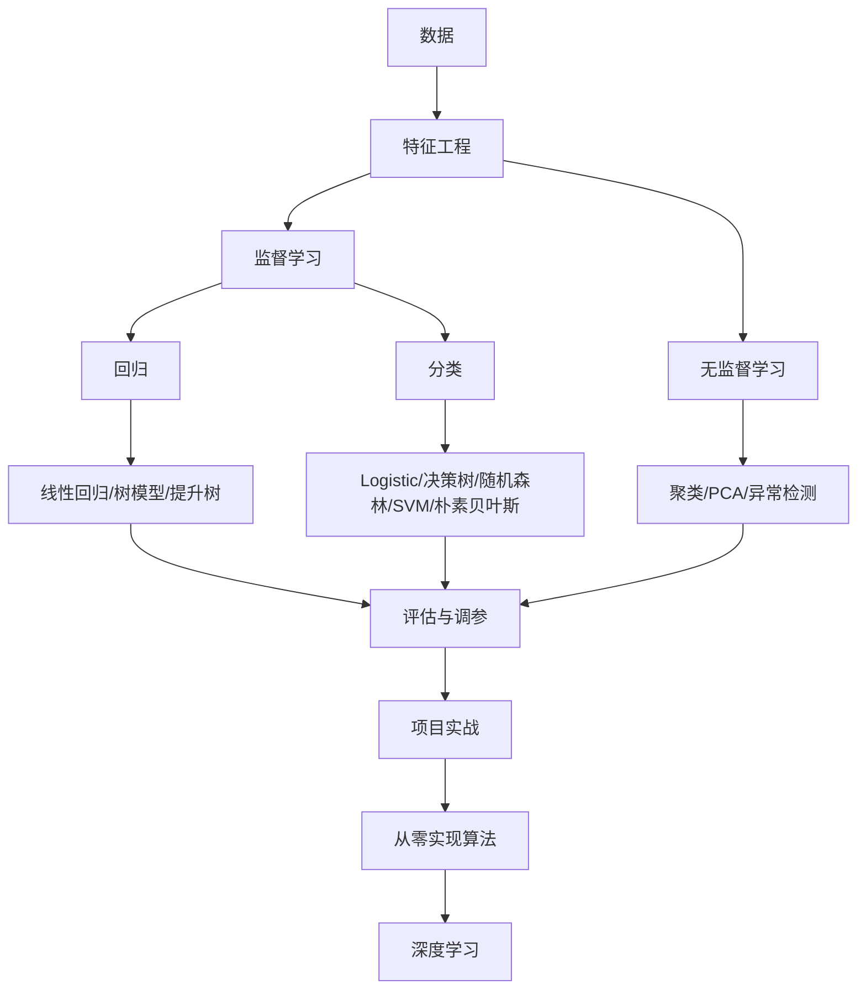

# 机器学习学习索引

这个目录负责把机器学习从零基础讲清楚：先中文理解，再项目练习，最后用 GitHub 原文仓库查资料和深入。

## 推荐学习顺序

| 顺序 | 笔记 | 目标 |
|---:|---|---|
| 1 | [[../01-基础准备/基础准备学习索引\|基础准备学习索引]] | 补 Python、数学、pandas |
| 2 | [[中文学习版/机器学习中文教材索引\|机器学习中文教材索引]] | 进入源仓库的一比一中文学习版 |
| 3 | [[机器学习零基础中文速学]] | 用中文理解样本、特征、标签、模型、评估 |
| 4 | [[机器学习核心知识中文教程]] | 系统学习监督学习、无监督学习、评估、调参 |
| 5 | [[机器学习从零到高手学习路径]] | 看完整成长路线 |
| 6 | [[机器学习中文导读-GitHub仓库]] | 知道每个 GitHub 仓库怎么用 |
| 7 | [[GitHub机器学习教程资源]] | 查精选资源 |
| 8 | [[90-资料库/01-GitHub原文/机器学习/00-机器学习GitHub原文索引\|GitHub 教程原文]] | 看原仓库代码和 Notebook |
| 8 | [[../91-项目实战/01-房价预测/房价预测项目说明\|房价预测项目]] | 做第一个回归项目 |
| 9 | [[../91-项目实战/02-Titanic生存预测/Titanic生存预测项目说明\|Titanic 项目]] | 做第一个二分类项目 |
| 10 | [[03-深度学习/01-神经网络与深度学习/chap2机器学习概述/机器学习概述-上\|机器学习概述-上]] | 接入神经网络课程体系 |

## 最强资源怎么分工

| 资源 | 角色 | 本地/外部入口 | 什么时候用 |
|---|---|---|---|
| Microsoft ML-For-Beginners | 入门主线 | [[90-资料库/01-GitHub原文/机器学习/ML-For-Beginners/README\|本地]] | 中文概念理解后，用它做英文课程练习 |
| Microsoft Data Science for Beginners | 数据科学前置 | [[90-资料库/01-GitHub原文/基础准备/Data-Science-For-Beginners/README\|本地]] | pandas、可视化、数据分析不熟时 |
| Datawhale 南瓜书 | 中文公式推导 | [[90-资料库/01-GitHub原文/基础准备/pumpkin-book/README\|本地]] | 想补西瓜书公式细节时 |
| Joyful Pandas | 中文 pandas | [[90-资料库/01-GitHub原文/基础准备/joyful-pandas/README\|本地]] | 表格处理不熟时 |
| Hands-On ML | 端到端实战 | [[90-资料库/01-GitHub原文/机器学习/handson-ml3/README\|本地]] | 做完 2 个小项目后 |
| scikit-learn 官方文档 | API 标准答案 | [官方文档](https://scikit-learn.org/stable/) | 查模型参数、评估指标 |
| Made With ML | 工程化 | [[90-资料库/01-GitHub原文/机器学习/Made-With-ML/README\|本地]] | 会训练模型后 |
| d2l 中文 | 深度学习过渡 | [[90-资料库/01-GitHub原文/机器学习/d2l-zh/README\|本地]] | 经典 ML 学完后 |

## 机器学习最小知识树

## 每个阶段的过关标准

| 阶段 | 过关标准 |
|---|---|
| 概念 | 能解释样本、特征、标签、模型、损失、训练、测试 |
| 数据 | 能独立读表、查缺失值、画图、写数据体检报告 |
| 回归 | 能做房价预测，解释 MAE/RMSE |
| 分类 | 能做 Titanic 二分类，解释 precision/recall/F1 |
| 无监督 | 能做 K-Means 聚类和 PCA 可视化 |
| 调参 | 能用交叉验证和网格搜索 |
| 项目 | 能写项目说明、模型对比、错误分析 |
| 原理 | 能手写线性回归和 Logistic 回归核心训练循环 |

## 不建议

- 不要一开始读论文。
- 不要一开始看从零实现。
- 不要同时开 10 个教程。
- 不要跳过数据清洗和评估。
- 不要用大模型替代自己跑代码。
