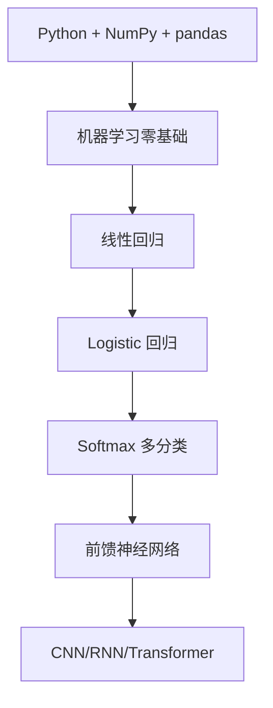

# 机器学习零基础入门

机器学习不是“让电脑变聪明”的魔法，而是：用数据训练一个函数，让它在新样本上做出尽量可靠的预测。

一句话版本：

$$
\text{数据} + \text{模型} + \text{损失函数} + \text{优化算法} \rightarrow \text{可用于预测的模型}
$$

这篇笔记只解决入门问题：先知道要学什么、为什么学、学到什么程度可以继续读后面的神经网络内容。

> [!tip]
> 如果你想按完整路径学习，先看 [[机器学习从零到高手学习路径]]，再回到这篇补基础概念。

## 1. 先建立最小概念

### 1.1 样本、特征、标签

| 概念 | 含义 | 例子 |
|---|---|---|
| 样本 | 一条数据 | 一套房子、一张图片、一条广告 |
| 特征 | 描述样本的输入变量 | 面积、楼层、图片像素、点击率 |
| 标签 | 希望模型预测的答案 | 房价、类别、是否转化 |
| 模型 | 从特征到预测结果的函数 | 线性回归、决策树、神经网络 |

例子：预测房价时，房屋面积、卧室数、地段评分是特征，真实成交价是标签，模型要学的是“这些特征如何影响价格”。

### 1.2 监督学习、无监督学习、强化学习

| 类型 | 是否有标签 | 典型任务 |
|---|---:|---|
| 监督学习 | 有 | 回归、分类 |
| 无监督学习 | 无 | 聚类、降维、异常检测 |
| 强化学习 | 通过奖励反馈 | 游戏、机器人、策略优化 |

入门阶段先抓住监督学习。大多数业务问题，比如房价预测、垃圾邮件识别、广告转化预测，都可以先用监督学习理解。

### 1.3 回归和分类

- **回归**：预测连续数值，比如房价、销量、温度。
- **分类**：预测离散类别，比如是否欺诈、图片是猫还是狗、用户是否会流失。

如果预测值能做加减乘除，通常是回归；如果预测值是一个类别，通常是分类。

## 2. 机器学习的五个核心问题

| 问题 | 入门时要会问什么 |
|---|---|
| 数据 | 数据从哪里来？是否有缺失、异常、泄漏？ |
| 特征 | 哪些字段可能帮助预测？是否需要标准化、编码？ |
| 模型 | 用简单模型能不能先跑通？ |
| 损失 | 模型错了多少？错在哪里？ |
| 评估 | 在没见过的数据上表现如何？ |

> [!tip]
> 新手最容易跳过“评估”。只看训练集准确率没有意义，模型可能只是把训练数据背下来了。

## 3. 最小学习路线

### 第 0 阶段：Python 数据处理

目标不是成为 Python 专家，而是能读写数据、看懂数组形状、画基本图。

要掌握：

- `list`、`dict`、函数、循环、条件判断
- `NumPy` 数组和矩阵运算
- `pandas` 读 CSV、筛选列、处理缺失值
- `matplotlib` / `seaborn` 画散点图、直方图、折线图

练习：用 `pandas.read_csv()` 读一个 Kaggle 表格数据，输出前 5 行、列名、缺失值数量。

### 第 1 阶段：数学直觉

入门阶段不需要先啃完高等数学教材。先够用：

| 数学 | 够用标准 |
|---|---|
| 线性代数 | 知道向量、矩阵、矩阵乘法、点积 |
| 概率统计 | 知道均值、方差、分布、条件概率 |
| 微积分 | 知道导数表示变化率，梯度表示往哪里改参数 |
| 优化 | 知道梯度下降是沿着损失下降方向更新参数 |

先用代码和图理解，再回头补公式。论坛里常见的有效建议也是这个顺序：Python、数学直觉、核心 ML，再进入深度学习和 LLM。

### 第 2 阶段：监督学习主线

按这个顺序学：

1. 线性回归：理解“用一条线/一个平面拟合数据”。
2. Logistic 回归：理解“把线性输出变成概率”。
3. 决策树和随机森林：理解非线性、特征重要性、过拟合。
4. 支持向量机 / KNN / 朴素贝叶斯：知道适用场景即可。
5. 模型评估：训练集、验证集、测试集，准确率、精确率、召回率、F1、AUC、MSE。

不要一开始追模型数量。先把一个完整流程跑顺：加载数据、切分数据、训练、评估、解释错误。

### 第 3 阶段：项目练习

推荐 3 个小项目：

| 项目 | 类型 | 学到什么 |
|---|---|---|
| 房价预测 | 回归 | 特征、标准化、MSE |
| 鸢尾花分类 | 多分类 | 分类边界、准确率 |
| Titanic 生存预测 | 二分类 | 缺失值、类别编码、验证集 |

每个项目都按同一个模板写：

1. 问题是什么？
2. 标签是什么？
3. 特征有哪些？
4. 怎么切分训练/测试？
5. 基线模型表现如何？
6. 错误样本有什么规律？

## 4. 从零到能读本项目的路径

在本项目里，可以这样衔接：

- 入门总览：[[02-机器学习/机器学习学习索引|机器学习]]
- 概念和路线：[[机器学习零基础入门]]
- 线性回归：[[03-深度学习/01-神经网络与深度学习/chap2机器学习概述/机器学习概述-上|机器学习概述-上]]
- 训练与评估：[[03-深度学习/01-神经网络与深度学习/chap2机器学习概述/机器学习概述-下|机器学习概述-下]]
- 二分类：[[03-深度学习/01-神经网络与深度学习/chap3线性模型/线性模型-上|线性模型-上]]
- 多分类：[[03-深度学习/01-神经网络与深度学习/chap3线性模型/线性模型-下|线性模型-下]]

## 5. 资源怎么用

| 资源 | 怎么用 | 不建议怎么用 |
|---|---|---|
| [[90-资料库/01-GitHub原文/机器学习/ML-For-Beginners/README|Microsoft ML-For-Beginners]] | 当主线课程，按章节学 | 一次性收藏不动 |
| [[90-资料库/01-GitHub原文/机器学习/zero-to-mastery-ml/README|Zero to Mastery ML]] | 跟 Notebook 敲代码 | 只看不运行 |
| [[90-资料库/01-GitHub原文/机器学习/handson-ml3/README|Hands-On ML notebooks]] | 做端到端项目和 sklearn 实战 | 零基础第一天直接硬啃 |
| [Kaggle Learn](https://www.kaggle.com/learn/intro-to-machine-learning) | 用短练习巩固 | 当作完整理论课 |
| [DeepLearning.AI ML Specialization](https://www.deeplearning.ai/courses/machine-learning-specialization/) | 系统补理论 | 没写代码就一直看视频 |
| [[90-资料库/01-GitHub原文/机器学习/ML-From-Scratch/README|ML-From-Scratch]] | 学完算法后看实现 | 入门第一天就硬啃 |
| [[90-资料库/01-GitHub原文/机器学习/Made-With-ML/README|Made With ML]] | 学完基础后看工程化 | 还不会训练模型就学 MLOps |

论坛和社区的经验可以参考，但不要用它们替代课程。Reddit `r/learnmachinelearning` 里反复出现的共识是：先补 Python、概率统计、线性代数，再做小项目；不要长期停在“找路线图”阶段。

更完整的仓库清单见 [[GitHub机器学习教程资源]]，分阶段路线见 [[机器学习学习路线]]。

## 6. 常见误区

### 误区 1：先把数学全部学完

不需要。先学到能理解线性回归、损失函数、梯度下降，再边做边补。

### 误区 2：只追深度学习和大模型

深度学习是机器学习的一部分。不会数据切分、过拟合、评估指标，直接学 Transformer 会很虚。

### 误区 3：训练准确率高就代表模型好

训练集表现好只能说明模型记住了训练数据。真正要看验证集和测试集。

### 误区 4：一上来就调复杂模型

先做简单基线，比如线性回归、Logistic 回归、决策树。复杂模型只有在简单模型不够时才值得上。

## 7. 入门检查表

- [ ] 我能解释样本、特征、标签、模型、损失函数。
- [ ] 我能区分回归和分类。
- [ ] 我能用 `pandas` 读 CSV，并查看缺失值。
- [ ] 我知道为什么要分训练集、验证集、测试集。
- [ ] 我跑过一个 scikit-learn 模型。
- [ ] 我知道过拟合是什么意思。
- [ ] 我能说出准确率、精确率、召回率的区别。

完成这些，再进入 [[03-深度学习/01-神经网络与深度学习/chap2机器学习概述/机器学习概述-上|机器学习概述-上]] 会顺很多。
