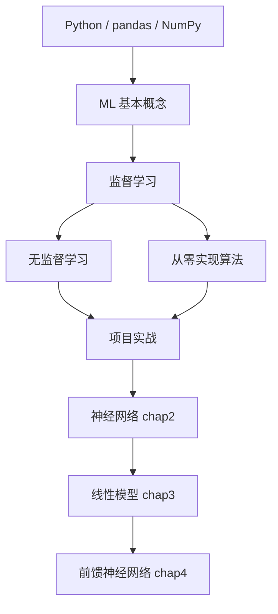

# 机器学习学习路线

这条路线按“能继续读本项目后续内容”为目标，不追求把机器学习所有分支一次学完。

> [!info]
> 完整中文路线见 [[机器学习从零到高手学习路径]]。本页是快速版。

## 0. 准备阶段：Python 和数据处理

目标：能打开数据、观察数据、做简单清洗和可视化。

要会：

- Python 基础语法；
- NumPy 数组；
- pandas 表格处理；
- Matplotlib / Seaborn 画图；
- Jupyter Notebook 基本使用。

推荐资源：

- [mrdbourke/zero-to-mastery-ml](https://github.com/mrdbourke/zero-to-mastery-ml)
- [Moataz-Elmesmary/Data-Science-Roadmap](https://github.com/moataz-elmesmary/data-science-roadmap)

完成标准：

- [ ] 能读 CSV；
- [ ] 能查看数据形状、列名、缺失值；
- [ ] 能画出一个特征和标签的关系图。

## 1. 入门阶段：知道机器学习在做什么

目标：理解样本、特征、标签、模型、损失函数、训练集、验证集、测试集。

推荐资源：

- [[机器学习零基础入门]]
- [microsoft/ML-For-Beginners](https://github.com/microsoft/ML-For-Beginners)
- [Kaggle Learn: Intro to Machine Learning](https://www.kaggle.com/learn/intro-to-machine-learning)

完成标准：

- [ ] 能解释监督学习和无监督学习；
- [ ] 能区分回归和分类；
- [ ] 能说清为什么要分训练集和测试集；
- [ ] 能跑通一个 sklearn 模型。

## 2. 经典监督学习

目标：掌握机器学习最常用的模型和评估方法。

学习顺序：

1. 线性回归；
2. Logistic 回归；
3. 决策树；
4. 随机森林；
5. KNN；
6. 朴素贝叶斯；
7. SVM；
8. 梯度提升树。

推荐资源：

- [microsoft/ML-For-Beginners](https://github.com/microsoft/ML-For-Beginners)
- [ageron/handson-ml3](https://github.com/ageron/handson-ml3)
- [glouppe/tutorials-scikit-learn](https://github.com/glouppe/tutorials-scikit-learn)
- [tirthajyoti/Machine-Learning-with-Python](https://github.com/tirthajyoti/Machine-Learning-with-Python)

完成标准：

- [ ] 能训练回归模型并用 MSE / MAE 评估；
- [ ] 能训练分类模型并用 accuracy / precision / recall / F1 评估；
- [ ] 能解释过拟合和欠拟合；
- [ ] 能用交叉验证选择模型。

## 3. 无监督学习

目标：知道没有标签时常见问题怎么做。

学习顺序：

1. K-Means 聚类；
2. PCA 降维；
3. 异常检测；
4. 简单推荐系统。

推荐资源：

- [microsoft/ML-For-Beginners](https://github.com/microsoft/ML-For-Beginners)
- [ageron/handson-ml3](https://github.com/ageron/handson-ml3)

完成标准：

- [ ] 能用 K-Means 做聚类并解释聚类结果；
- [ ] 能用 PCA 把高维数据降到 2 维可视化；
- [ ] 知道无监督学习结果通常更需要人工解释。

## 4. 算法内部原理

目标：不只会调包，还能理解模型为什么这么训练。

推荐资源：

- [eriklindernoren/ML-From-Scratch](https://github.com/eriklindernoren/ML-From-Scratch)
- [patrickloeber/MLfromscratch](https://github.com/patrickloeber/MLfromscratch)

学习方法：

1. 先用 sklearn 跑通算法；
2. 再看从零实现；
3. 最后自己写一个极简版本。

完成标准：

- [ ] 能手写线性回归训练；
- [ ] 能解释 Logistic 回归的 sigmoid 和交叉熵；
- [ ] 能解释决策树如何分裂节点。

## 5. 项目阶段

目标：用真实数据完整做一次机器学习流程。

项目顺序：

| 项目 | 类型 | 推荐数据 |
|---|---|---|
| 房价预测 | 回归 | California Housing / Kaggle House Prices |
| Titanic 生存预测 | 二分类 | Kaggle Titanic |
| 鸢尾花分类 | 多分类 | sklearn Iris |
| 客户流失预测 | 二分类 | Kaggle churn dataset |

每个项目都要写清楚：

1. 问题定义；
2. 数据来源；
3. 特征处理；
4. 基线模型；
5. 评估指标；
6. 错误分析；
7. 下一步改进。

推荐资源：

- [Kaggle Learn](https://www.kaggle.com/learn)
- [ageron/handson-ml3](https://github.com/ageron/handson-ml3)
- [GokuMohandas/Made-With-ML](https://github.com/GokuMohandas/Made-With-ML)

## 6. 和本项目的衔接

学完上面内容后，按这个顺序进入本项目已有材料：

1. [[神经网络/chap2机器学习概述/机器学习概述-上|机器学习概述-上]]
2. [[神经网络/chap2机器学习概述/机器学习概述-下|机器学习概述-下]]
3. [[神经网络/chap3线性模型/线性模型-上|线性模型-上]]
4. [[神经网络/chap3线性模型/线性模型-下|线性模型-下]]
5. [[神经网络/chap4前馈神经网络/前馈神经网络-上|前馈神经网络-上]]

