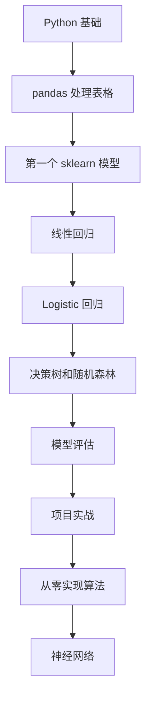

# 机器学习零基础中文速学

这篇是中文学习版，不要求你先看英文仓库。目标是先把机器学习的主干学明白，再用 GitHub 仓库做练习。

## 1. 机器学习到底是什么

机器学习就是让电脑从数据里总结规律，然后用这个规律预测新数据。

例子：

| 问题 | 输入特征 | 预测目标 |
|---|---|---|
| 房价预测 | 面积、城市、楼层、房龄 | 房价 |
| 垃圾邮件识别 | 邮件文本、发件人、链接数量 | 是否垃圾邮件 |
| 用户流失预测 | 登录次数、消费金额、最近活跃时间 | 是否会流失 |
| 图片分类 | 图片像素 | 图片类别 |

机器学习的核心不是“模型很高级”，而是这 5 步：

1. 收集数据；
2. 整理特征；
3. 选择模型；
4. 用训练数据学习参数；
5. 用新数据评估效果。

## 2. 最重要的 10 个概念

| 概念 | 中文解释 | 例子 |
|---|---|---|
| 样本 | 一条数据 | 一套房子 |
| 特征 | 输入变量 | 面积、房龄、地段 |
| 标签 | 正确答案 | 成交价 |
| 模型 | 从特征到结果的函数 | 线性回归、决策树 |
| 参数 | 模型学出来的数 | 每个特征的权重 |
| 损失函数 | 衡量预测错多少 | MSE、交叉熵 |
| 训练 | 调整参数，让损失变小 | 梯度下降 |
| 泛化 | 在新数据上也表现好 | 测试集分数高 |
| 过拟合 | 训练集好，新数据差 | 背答案 |
| 特征工程 | 把原始数据变成模型能用的数据 | 类别编码、标准化 |

## 3. 回归、分类、聚类

### 回归

预测连续数值。

例子：

- 预测房价；
- 预测销量；
- 预测气温；
- 预测广告转化率。

常用指标：

- MAE：平均绝对误差，直观；
- MSE：平方误差，对大错误更敏感；
- RMSE：和原单位一致的平方根误差。

### 分类

预测类别。

例子：

- 是否垃圾邮件；
- 是否会流失；
- 图片是猫还是狗；
- 新闻属于体育、财经还是科技。

常用指标：

- accuracy：准确率；
- precision：预测为正的里面有多少是真的；
- recall：真实为正的里面找回了多少；
- F1：precision 和 recall 的折中。

### 聚类

没有标签，让模型自己把相似样本分组。

例子：

- 用户分群；
- 商品分组；
- 异常客户发现。

## 4. 一条最短学习路线

## 5. 先学哪些算法

| 顺序 | 算法 | 为什么先学 |
|---:|---|---|
| 1 | 线性回归 | 最容易理解“特征加权求和” |
| 2 | Logistic 回归 | 二分类基础，很多模型都借鉴它 |
| 3 | 决策树 | 像人做判断，容易解释 |
| 4 | 随机森林 | 常用、稳定、适合表格数据 |
| 5 | K-Means | 无监督学习入门 |
| 6 | PCA | 降维和可视化入门 |
| 7 | 梯度提升树 | 表格数据强基线 |
| 8 | 神经网络 | 深度学习入口 |

## 6. 第一个项目怎么做

推荐先做房价预测。

步骤：

1. 读入数据；
2. 查看字段含义；
3. 找出标签列，比如房价；
4. 处理缺失值；
5. 把数据分成训练集和测试集；
6. 训练线性回归；
7. 训练随机森林；
8. 比较 MAE / RMSE；
9. 找出预测最差的 10 条样本；
10. 写总结：模型为什么错。

## 7. 新手最容易错的地方

| 错误 | 为什么错 | 正确做法 |
|---|---|---|
| 只看训练集分数 | 可能只是背下训练数据 | 一定看测试集 |
| 一上来用复杂模型 | 不知道提升来自哪里 | 先做简单基线 |
| 不处理缺失值 | 很多模型会报错 | 先统计缺失值 |
| 忘记类别编码 | 字符串不能直接进模型 | 用 one-hot 或编码器 |
| 先标准化再切分数据 | 测试集信息泄漏 | 先切分，再只用训练集拟合标准化 |
| 只追准确率 | 类别不平衡时会骗人 | 看 precision、recall、F1 |

## 8. 中文学习顺序

1. [[机器学习零基础中文速学]]
2. [[机器学习从零到高手学习路径]]
3. [[机器学习中文导读-GitHub仓库]]
4. [[机器学习零基础入门]]
5. [[神经网络/chap2机器学习概述/机器学习概述-上|机器学习概述-上]]

## 9. 过关检查

- [ ] 我能解释样本、特征、标签。
- [ ] 我知道回归和分类的区别。
- [ ] 我能说清为什么要分训练集和测试集。
- [ ] 我能用 sklearn 训练一个模型。
- [ ] 我知道过拟合是什么。
- [ ] 我能看懂 MAE、RMSE、accuracy、precision、recall、F1。
- [ ] 我能独立完成一个小项目。

